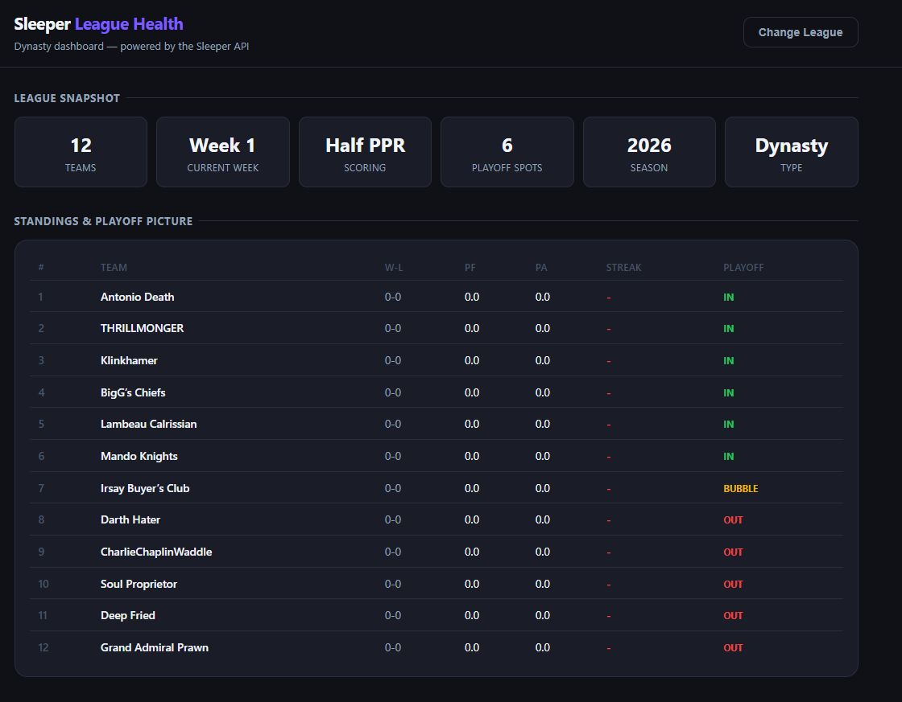

# Sleeper League Health Dashboard

A single-page dynasty fantasy football dashboard built on the public [Sleeper API](https://docs.sleeper.com). No backend, no login, no build tools — just drop it on GitHub Pages and go.

**[Live Demo →](https://nageemsemaj.github.io/sleeper-league-dashboard)**

---

## The Problem

Dynasty managers track standings in one place, roster age in another, and trade activity nowhere at all. There's no single view that tells you whether your league is healthy — who's contending, who's rebuilding, and who's gone quiet.

This dashboard surfaces all of it in one page.

---

## Features

- **League lookup** by Sleeper username (shows all your leagues) or direct league ID
- **Standings & playoff picture** with win/loss, points for/against, current streak, and clinch/bubble/elimination indicators
- **Roster age & dynasty health** with per-team age bars, color-coded contention windows, and a league-wide age distribution chart
- **Trade & waiver activity** with a recent transaction feed, week-by-week volume chart, and per-manager activity scoring
- **Manager spotlight** with clickable cards that expand into full roster, age breakdown, and transaction history
- Player database cached in `localStorage` after first load — subsequent loads are fast

---

## Tech

- Vanilla HTML, CSS, and JavaScript — no framework, no build step
- [Chart.js](https://www.chartjs.org/) via CDN for the age distribution and transaction volume charts
- Pure CSS bar charts for the simpler data displays
- Hosted on GitHub Pages

The Sleeper API is fully public and CORS-friendly — all data is fetched directly from the browser.

---

## Getting Started

1. Clone or download this repo
2. Open `index.html` in a browser — it works locally with no server needed
3. Enter your Sleeper username or a league ID

To host it publicly on GitHub Pages:

1. Push to a GitHub repo
2. Go to **Settings → Pages**
3. Set source to the `main` branch, root folder
4. Your dashboard will be live at `https://yourusername.github.io/repo-name`

---

## Usage Notes

- **Season data**: The dashboard auto-detects the current NFL week via `/state/nfl`. During the offseason, week will show as 0 or 1 and matchup data will be limited.
- **Player ages**: Pulled from Sleeper's player database. Ages may show as `?` during deep offseason if Sleeper's DB hasn't been refreshed yet.
- **Transaction history**: Loads the last 3 weeks of transactions. Earlier weeks aren't fetched to keep load times reasonable.
- **Multiple leagues**: If you enter a username, you'll see all NFL leagues tied to that account for the current season — dynasty, redraft, and keeper alike.

---

## Background

I built this after noticing that dynasty managers — myself included — were jumping between the Sleeper app, spreadsheets, and dynasty value sites just to get a basic read on their league. The goal was a zero-friction snapshot: paste your username, see everything that matters.

This is part of an ongoing portfolio of tools built around fantasy sports data. See also: [sleeper-dynasty-roster-sync](https://github.com/nageemsemaj/sleeper-dynasty-roster-sync), a Google Apps Script that syncs Sleeper roster data to Google Sheets.

---

## Roadmap

- [ ] Injury and news feed per roster
- [x] Historical season comparison (year-over-year standings)
- [ ] Dynasty value integration (KeepTradeCut or similar)
- [ ] Shareable per-manager links
- [ ] Multi-league switcher without returning to the entry screen

---

## License

MIT
